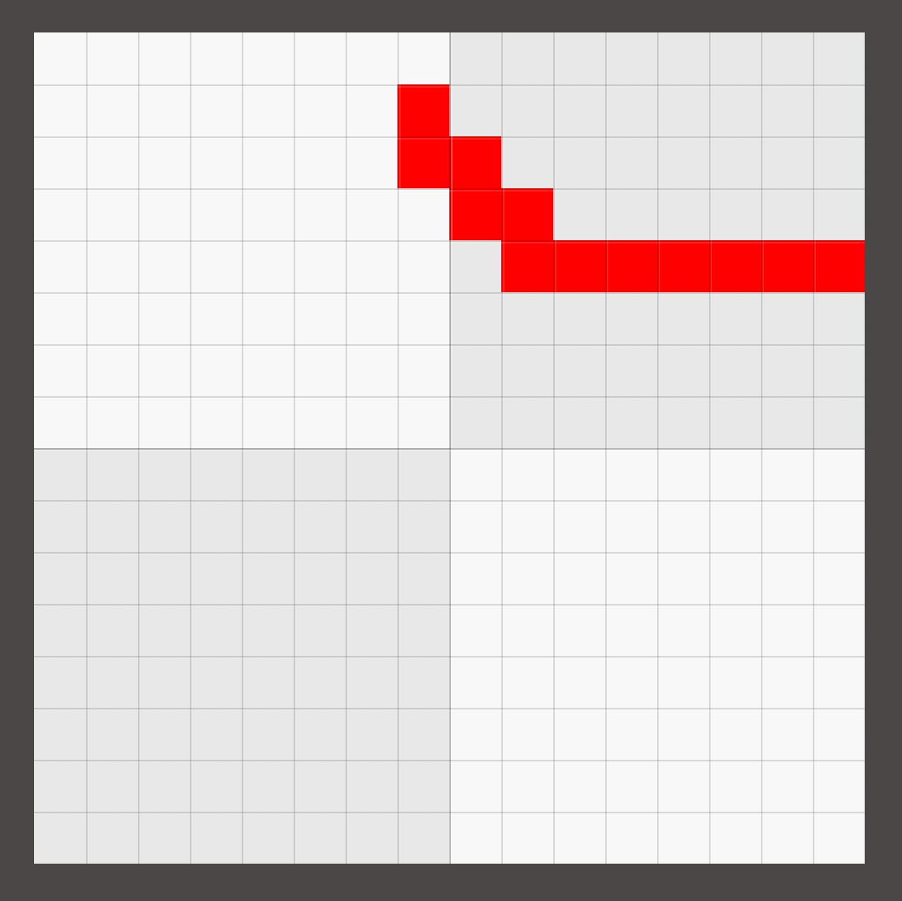
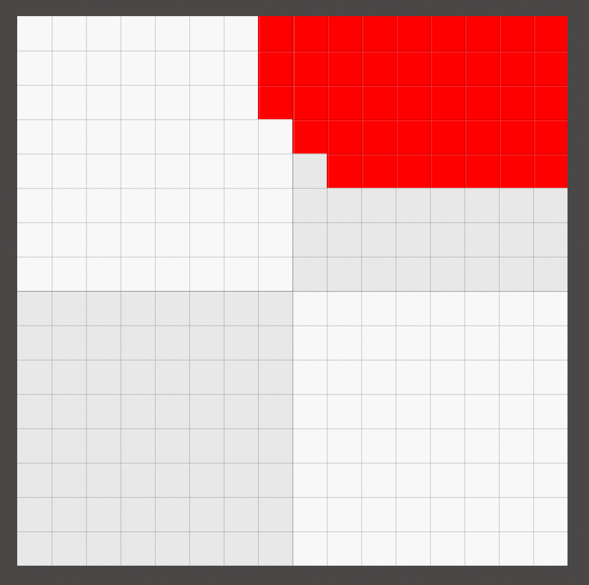

TangTaMeokGi
===

위대하신 코마라는 유튜버가 제작한 땅따먹기 플러그인 베포가 안되었어서
직접 만들고 있는 겁니다.

근데 똑같이 구현하진 않고 제 고갱님 시키는거 따라서 만드는중

참고롤 이 리드미의 내용은.. 아직 전혀 구현되지 않았습니다!
요구사항을 작성한 이후 본격적인 코드 작성에 돌입할 예정입니다

기본 게임 매커니즘
===

> 고갱님깨서 요구하신 게임 모드는 총 5개로,
섬멸전, 점령전, 개인전, 팀 데스매치, 점수전이 있지만,
현재로썬 점령전만 구현할 예정입니다.

점령전의 유일한 목표는 팀을 이뤄 가장 많은 땅을 먹는겁니다.
이 모드는 어느 팀이 모든땅을 먹거나, 시간제한이 다 될때까지 진행됩니다.

리스폰은 무한히 가능합니다.

## 점령

땅 점령은 도끼를 통해 이루어 집니다.
이 도끼는 일반적인 도끼가 아니며, 특수한 조합법을 통해 흭득할수 있습니다.

이를 **땅 도끼** 라 부릅니다.

땅 도끼를 가지고 점령하고자 하는 땅에 들어간 상태로,
우클릭을 할시 점령을 할수 있는대, 땅의 종류마다 공성전을 치뤄야 하는경우도 있습니다.
자세한 내용은 바로 아래 [땅의 종류 / 특징](#땅의 종류-/-특징) 문단에서 확인할수 있습니다.

## 땅의 종류 / 특징

### 공용땅

게임을 처음 시작할시, 모든 땅은 기본적으로 이 공용땅입니다. 모든 팀의 진입이 자유롭습니다.
또한 땅 도끼만 있다면 즉시 점령 가능합니다

공용땅은, 일반 공용땅과, 효과 공용땅이 있습니다.

---
#### 일반 공용땅
이무런 효과가 없으며, 일반 공용땅에 대해 점령을 할경우,
해당 땅은 일반땅이 됩니다.
---
#### 효과 공용땅
이 땅에 어느 팀이 진입하든, 해당 효과 공용땅의 지정 버프를 부여받습니다.
또한 효과 공용땅이 처음 생겼을때, 내부적으로 디버프 또한 결정됩니다.
---
효과 공용땅에 대해 점령을 할경우, 효과땅이 되며,
해당 효과땅은 기존 효과 공용땅의 버프, 디버프를 동일하게 물려받습니다.

TODO 버프, 디버프 목록 작성
~~에토야 좀 알려줘~~

---

### 일반땅 / 효과땅

일반땅, 효과땅 둘다 적군이 진입 또는 점령 시도를 할시
아군에게 알림이 가며, 적군은 이 땅 내에서 블럭 파괴가 불가능합니다.
(공성전 중에도 적군은 이곳에서 블럭 파괴를 할수 없습니다)
---
#### 일반땅
일반 공용땅을 점령할시 볼수 있는 땅입니다.
아군이 진입할시 별다른 효과는 없습니다
---
#### 효과땅
효과 공용땅을 점령할시 볼수 있는 땅입니다,
아군이 진입할시 해당 땅의 지정 버프를 받으며,
적군이 진입할시 지정 디버프를 받습니다.
(버프, 디버프는 기존 효과 공용땅에서 동일하게 물려받습니다)
---
### 일번땅 / 효과땅 점령, 공성전

일반땅 / 효과땅에 점령을 시도할시, 해당 땅의 원 주인팀에게 알림이 전송됩니다.
또한 수비팀은 현재 공격받고 있는 땅으로 즉시 TP 할수 있습니다.

* 공격자는 해당 땅의 모든 수비자를 죽이거나 쫓아내야 하며,
수비자는 반대로 공성전이 끝날때까지 한명이라도 해당 땅 내에서 버텨야 합니다.

* 공성전이 시작될시 공격자에겐 신속 I 가 지급되며
수비자에겐, 힘 I 과 재생 I 이 적용됩니다.

* 효과땅에서 공성전이 시작될시 TODO

* 공성전에 한해, `/추적` 명령어를 통해 전장 내부의 
가장 가까운 공격자의 위치를 확인할수 있습니다.

* 수비자는, 공성전이 진행되는 땅에서 어떤 이유로든 죽거나, 나갈시에
공성전 진행동안 다신 해당 땅에 진입이 불가합니다.

* 만약 수비자가 단 한명이라도, 공성전이 끝날때까지 남아있다면
공성전이 종료되는 순간 수비자는 해당 땅을 지켜내고, 
해당 땅 내에 남아있는 모든 공격자는 즉사합니다.

* 만약 공성전이 끝나는 시점에 전장 내에 단 한명의 수비자도 남아있지 않다면,
해당 땅을 공격자에게 빼았깁니다.

## 땅 획득 시스템

만약 다음과 같이 특정 공간을 감싸 막는 형태로 점령을 시도할시,

다음과 같이 그 내부의 모든 땅 또한 획득합니다.

## 승리 / 패배 조건

특정 팀이 맵의 모든 땅을 획득할시 해당 팀은 승리합니다.

하지만 게임 시간이 종료될때까지 모든땅을 흭등한 팀이 나오지 않는다면,
가장 많은 땅을 가진 팀이 승리합니다.

기본 게임 세팅법
===

## 팀세팅

`/newteam` 명령어를 통해 새로운 팀을 만들수 있습니다
> `/newteam <팀 ID> "<팀 이름>" <팀 컬러>`

`<팀 ID>` 에는 공백이 불가능하며,
후에 명령어 상에서 팀을 구분하기 위한 수단입니다.
보통 `빨강팀` 이나 `에토와_커플의_개쩌는팀` 형식으로 짓는걸 권장합니다.

`<팀 이름>` 은 실제로 보여지는 팀 이름입니다. 
공백이 가능하지만, 큰따옴표로 묶어주어야 합니다.
예를들어 팀 이름을 `엄청난 팀` 으로 하고 싶은 경우,
명령어엔 `"엄청난 팀"` 처럼 큰따옴표로 묶어야 합니다.

`<팀 컬러>` 는 팀을 대표하는 색상입니다.
후에 지도에서 해당 팀이 이 색상으로 표시되며,
이 외에도 팀을 표시할때 또한 주로 사용되는 컬러입니다.

이후 `/jointeam` 을 통해 플레이어를 팀에 참여시킬수 있습니다.
> `/jointeam <팀 ID> <참여할 플레이어>`

## 맵 세팅

> 맵의 크기, 땅의 크기는 모두 정사각형 입니다.

`/generate` 를 통해 맵을 생성할수 있습니다

TODO

## 규칙 세팅

`/setgametime <분>`
`/setwartime <분>` 

TODO

## 게임 시작

팀이 2개 이상 생성되고 기타 세팅을 끝냈다면
`/start` 를 사용하여 게임을 시작할수 있습니다.

게임이 진행중인 도중에 일시 정지하고 싶다면 `/pause` 를 통해
게임 시간과 처리를 일시정지 할수 있습니다.

게임 진행 도중에 게임을 끝내고 싶다면 `/end` 를 통해
게임을 끝낼수 있습니다.

게임이 끝난 이후 `/reset` 을 통해
모든 팀이나 규칙 설정을 초기화 할수 있습니다.
하지만 `/generate` 로 생성된 맵은 초기화 되지 않으며,
필요한 경우 다시 `/generate` 를 사용하여 재생성이 필요합니다.

코드 관련
===

여기 아직 다 안썼습니다 읽지마세요.

땅 코드 구조
===

이 플러그인은 `Area` 라는 객체가 있고
그 내부에 속성으로 `AreaState` 가 들어갑니다.

실질적으로, 땅의 고유한 속성(효과땅의 효과, 소유 팀 정보) 등등은
`AreaState` 에 저장되며 `Area` 는 `AreaState` 를 감싸는
레퍼 클래스에 가깝습니다.

코드상의 땅 종류
===

`PUBLIC_AREA`:
* `PublicAreaState`

우리 고갱님요청사함 (TODO)
===
섬멸전. 적을 전부 처치하기 (또는 한정된 리스폰 기회를 가진 적을 전부 사살)

요걸로 갑시당
점령전. 시간내에 가장 많은 땅을 점령한 팀이 승리

개인전. 목숨 1개! 많은 땅을 확보하고 모든 적을 사살하라

팀 데스매치. 팀을 짜고 전략적 요충지를 확보하세요 가장 많은 적을 사살하여 점수가 높은 팀이 승리합니다!

점수전. 다양한 상호작용으로 점수를 얻으세요(킬,점령,딜량,등등) 가장 많은 점수를 얻은 팀이 승리합니다!